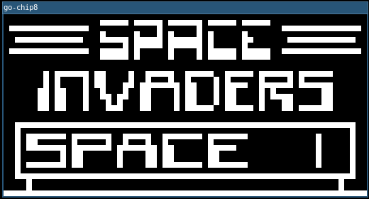
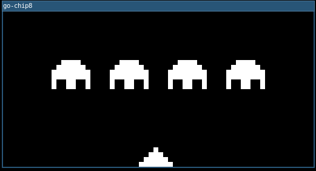

# go-chip8 [](https://goreportcard.com/report/github.com/arnaucube/go-chip8)

CHIP-8 emulator written in Go.

https://en.wikipedia.org/wiki/CHIP-8

### Usage
```
go run main.go -file roms/invaders.c8
```





